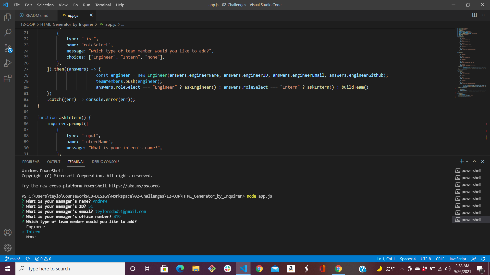
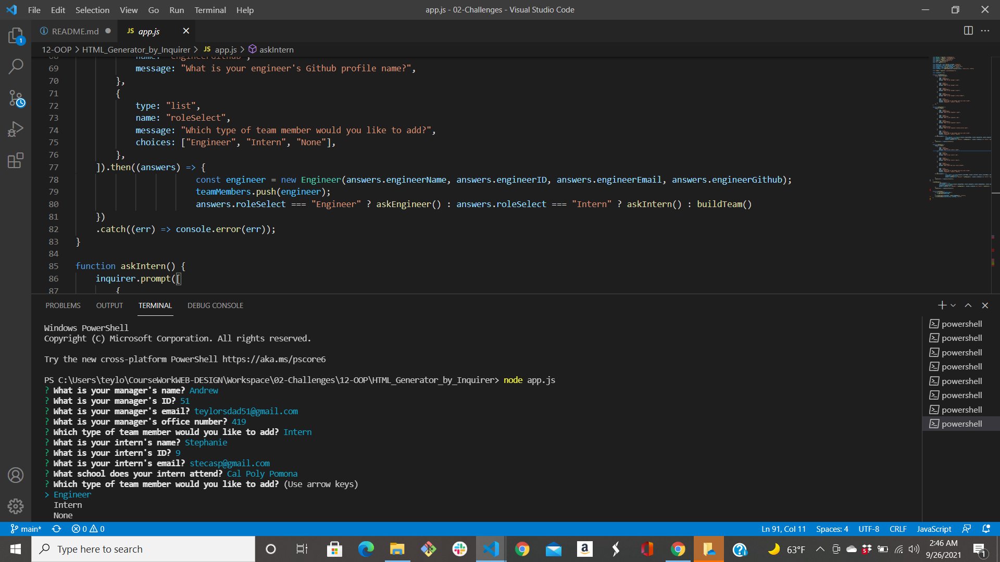
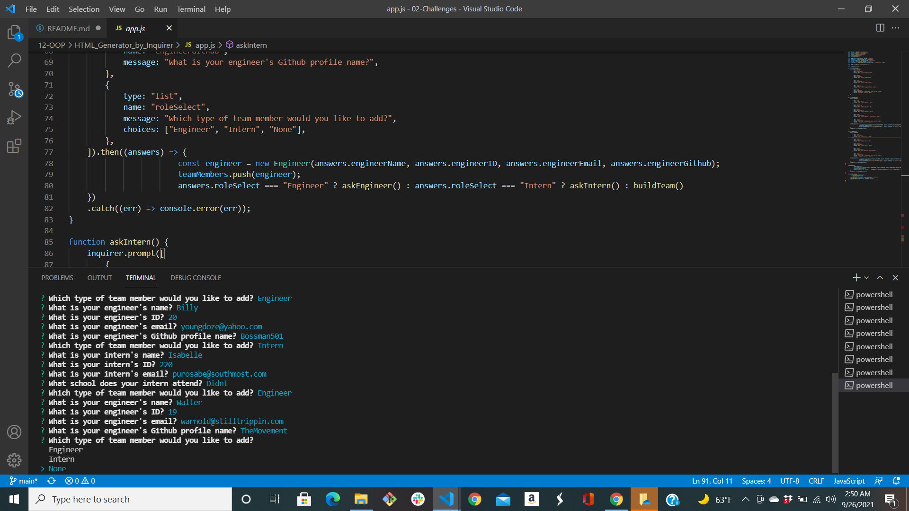
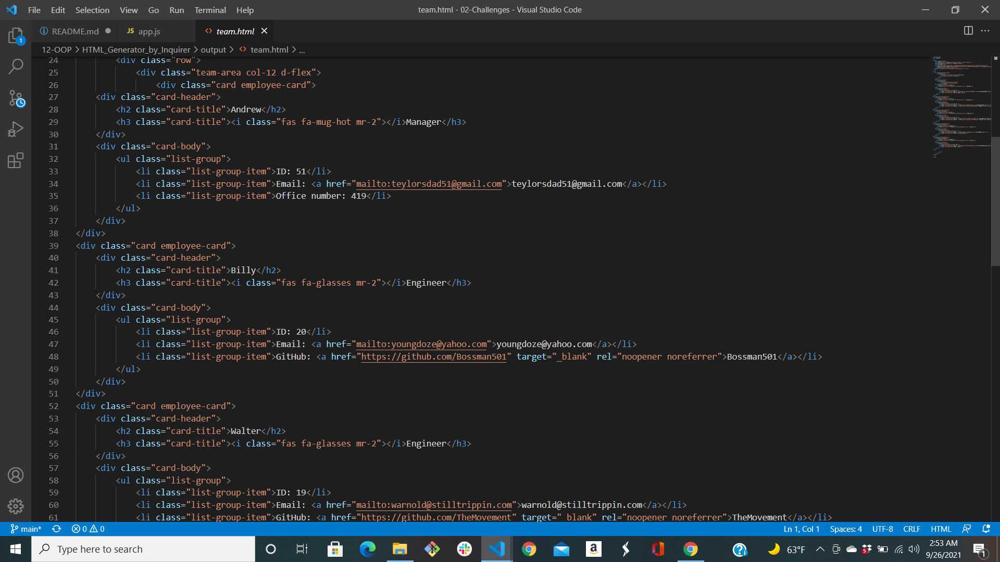
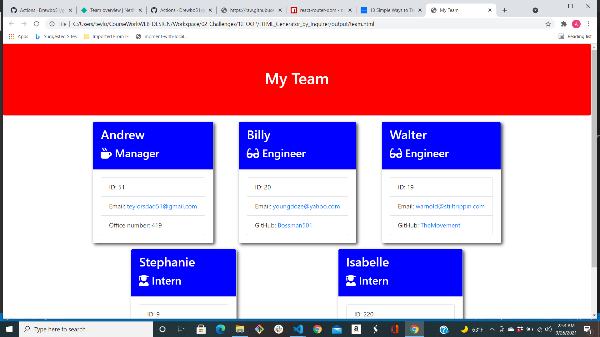
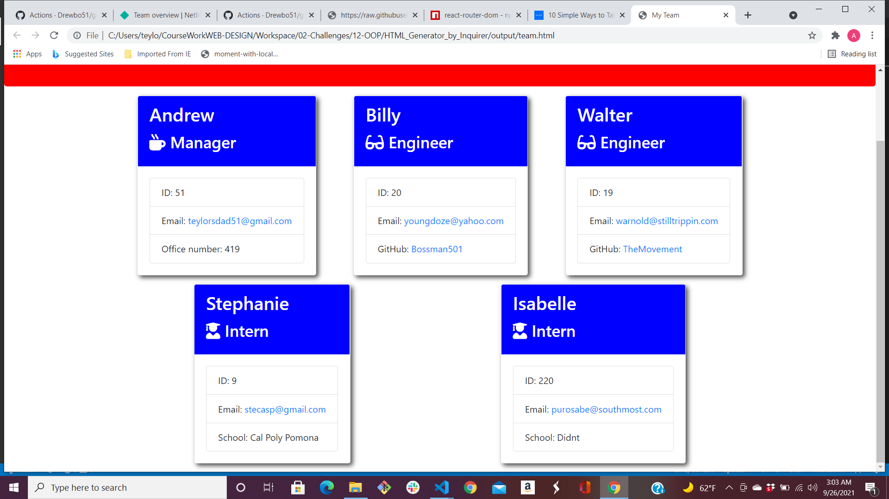

# HTML_Generator_by_Inquirer

1. Initially I fixed the tests and/or classes. In each of the classes the getRole() method returned a class object where the test was looking for a string matching the name of the class. Also there were a few other issues with the tests that I resolved and I changed the "Test" to "it" as well as adding "Describe".

2. Using vanilla Javascript I was unable to remove a class that was attached in "main.html" that was called "justify-content-center" so I just went into the template and removed the hard coding of it.

3. I wasn't able to dynamically create the "style.css" the way I wanted to, so I created a folder called "style" with a css stylesheet created in it. Then I created a method that used the "fs" to read and write a new "style.css" file that would be created and added to the output folder at the same time as the team list was created.(**code to create sheets below**)

```m
const styleDir = path.resolve(__dirname, "./style");
const cssOnPage = fs.readFileSync(path.resolve(styleDir, "style.css"), "utf-8");

const outputStyling = path.join(OUTPUT_DIR, "style.css");
fs.writeFileSync(outputStyling, cssOnPage, "utf-8");
```


4.I was unable to create the video of the walkthrough so I am attaching pictures of me using the inquirer to create the document.
















